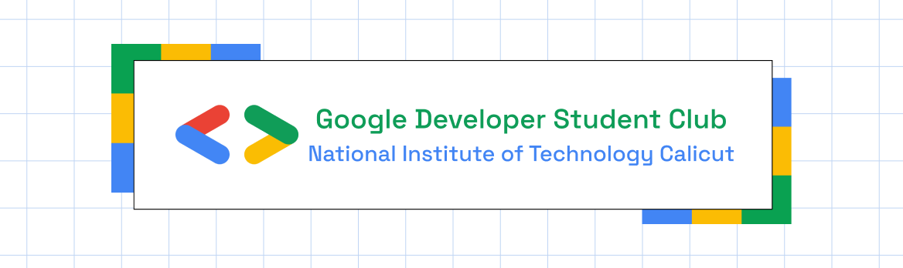

	<h2 align="center"> Activity Points Management System </h2>
	<h4 align="center"> The Activity Points Management System (APMS) is a web-based platform developed for the National Institute of Technology Calicut (NITC) to streamline the management, submission, and verification of student activity points, as mandated in the undergraduate curriculum. APMS serves as a centralized tool for all stakeholders-students, faculty advisors, event organizers, and administrators-to ensure transparent, efficient, and accurate tracking of activity points required for graduation. </h4>

---

## ✨ Features
- [ ]  Role-based Login with NITC email authentication (OAuth/Google Sign-In)
- [ ]  Activity Point Submission by students via proof upload and Tracking
- [ ]  Bulk Point Allocation by Coordinators
- [ ]  Faculty Approval Workflow

## 💻 Tech Stack 

- React
- Vite
- Typescript

## 🛠 Dependencies
- React Router DOM
- React Hook Form
- Tailwind CSS

## CONTRIBUTORS

<table>
	<tr align="center">
		<td>
		Enter Name
		

			
		

        

            
            
        

		</td>
	</tr>
    
</table>
